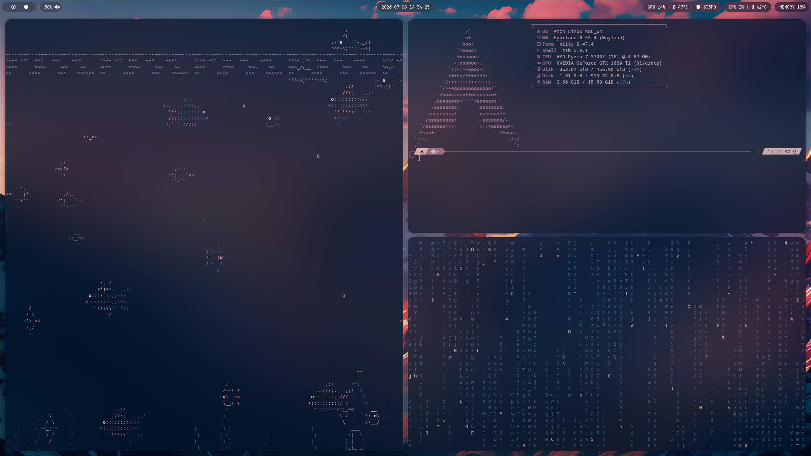
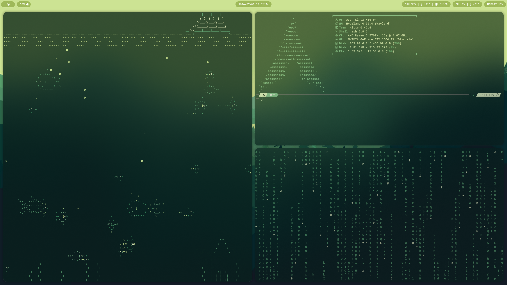
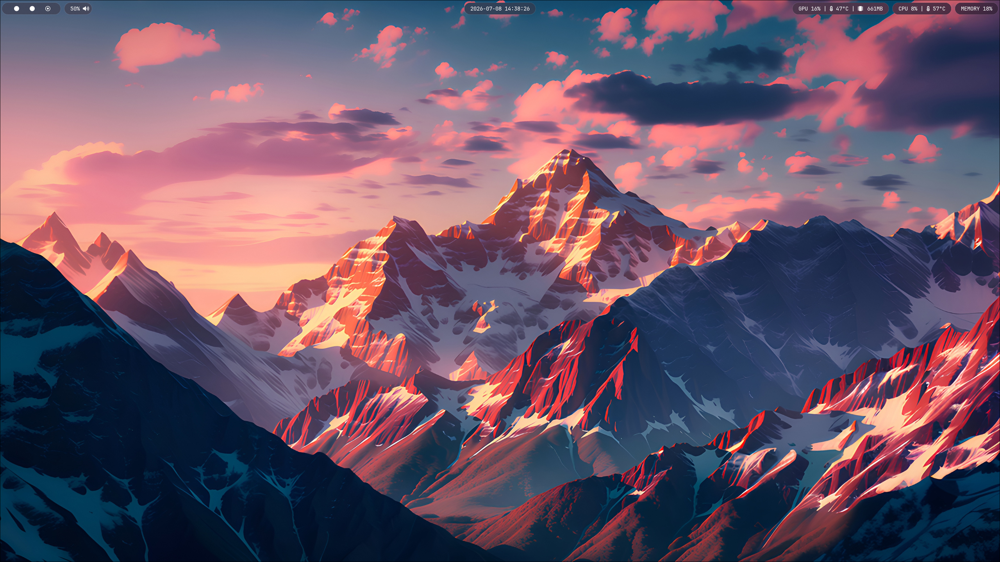
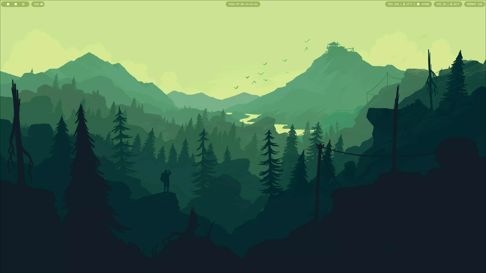
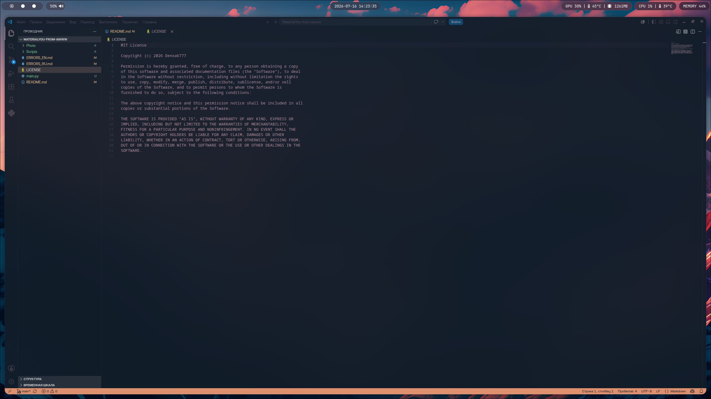
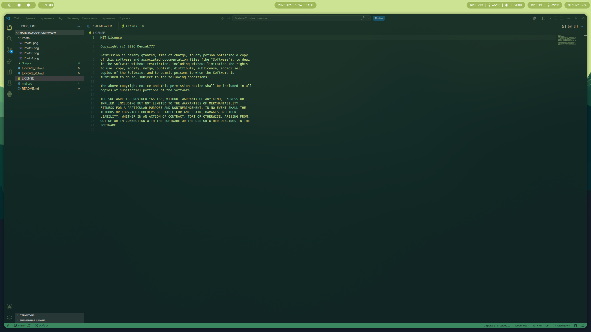

"MaterialYou from awww" is a simple and lightweight tool that extracts wallpaper information from awww and generates unique color palettes to theme your entire system.

**How it works?**

The program automatically checks awww to see which monitors are connected to your PC and what wallpapers are currently set on them. Using pywal, the script generates a color profile and saves it into a separate file. You can then easily use this palette to customize any other applications ***(terminals, status bars, etc.)***.

**Why pywal?**

It is the perfect tool for extracting accurate and beautiful color schemes directly from your own wallpapers.

**Key Features:**

Lightweight: The code is highly optimized, clean, and compact.
Multi-monitor Support: It generates individual color schemes for each monitor if you are using different wallpapers.
Fully Automated: It is incredibly easy to use — no manual input required.
Ready-to-use Configs: Copies the entire pywal cache (CSS, Xresources, JSON, etc.) so you can just plug them into Waybar or Kitty.

========================================================================================

"MaterialYou from awww" — это простая и компактная программа, которая берет информацию об обоях из утилиты awww и создаёт уникальные цветовые палитры для оформления вашей системы.

**Как это работает?**

Программа автоматически опрашивает awww, узнавая, какие мониторы подключены к вашему ПК и какие обои на них установлены. С помощью pywal скрипт генерирует цветовой профиль и сохраняет его в отдельный файл. Полученную палитру вы можете легко использовать для кастомизации любых других программ ***(терминала, статус-бара и т.д.)***.

**Почему используется pywal?**

Он идеально подходит для точного и красивого извлечения цветовой схемы прямо из ваших собственных обоев.

**Главные плюсы:**

Компактность: Код получился очень легким и чистым.
Мультимониторность: Скрипт создаёт отдельные цветовые схемы под каждый монитор, если у вас разные обои на каждом мониторе.
Автоматизация: Программа максимально проста в использовании — вам вообще ничего не нужно вводить вручную.
Всё включено: Копирует весь кэш pywal целиком (CSS, Kitty-конфиги, JSON), так что вам доступны любые форматы тем.

========================================================================================

**Dependencies | Зависимости**
1. Python 3.10+
2. Linux ***(Preferably on Arch Linux | Желательно на Arch Linux)***
3. awww ***(With Hyprland for better work | С Hyprland для лучшей работы)***
4. pywal16

========================================================================================

**Installation | Установка** 

Install awww and pywal | Установите awww и pywal

Arch Linux:
```bash
sudo pacman -Sy
yay -S awww python-pywal16
```

**Note | Важно**

This project was developed and tested on Arch Linux. Installation instructions in this README are intended for Arch Linux only. If you're using another distribution, please refer to the official documentation of the required packages | Проект разрабатывался и тестировался на Arch Linux. Инструкции по установке в README предназначены только для Arch Linux. Если вы используете другой дистрибутив, воспользуйтесь официальной документацией необходимых программ

Ubuntu / Debian / Fedora:
```bash
pip3 install pywal16
```
[Official project awww | Официальный проект awww](https://codeberg.org/LGFae/awww) - ***The author's official project. Please read how to properly install it on your distribution | Официальный проект автора. Пожалуйста, ознакомьтесь с инструкцией по правильной установке в вашем дистрибутиве***

Install and run "MaterialYou from awww" | Установите и запустите "MaterialYou from awww

```bash
git clone https://github.com/Denxak777/MaterialYou-from-awww.git
cd MaterialYou-from-awww
./main.py
```

========================================================================================

**Critical errors | Критические ошибки**

If you encounter an error, check the guide or message me to solve the issue | Если у вас произошла ошибка, изучите руководство или напишите мне для решение проблем

[Error Troubleshooting Guide](ERRORS_EN.md) | [Инструкция по исправлению ошибок](ERRORS_RU.md)

========================================================================================

**Generating color themes for applications | Генерация тем для программ**

1. Visual Studio Code / VSCodium

========================================================================================
**Screenshots | Скриншоты**

<table>
  <tr>
    <td width="50%"></td>
    <td width="50%"></td>
  </tr>
  <tr>
    <td width="50%"></td>
    <td width="50%"></td>
  </tr>
  <tr>
    <td width="50%"></td>
    <td width="50%"></td>
  </tr>
</table>